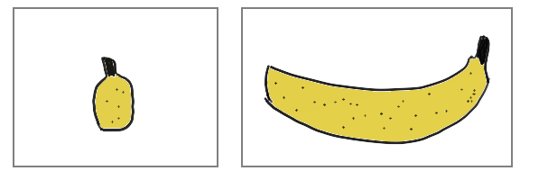

```{r setup, include=FALSE}
knitr::opts_chunk$set(echo = TRUE)
```

### Coordonnées  

Sacha Revillon (GQE,INRAe)

Mail : sacha.revillon@inrae.fr ou sacha.revillon@universite-paris-saclay.fr

### Objectifs du TP :
* Présentation d'un Rmarkdown
* Manipulation de variables dans R
* Fonctions usuelles
* Application sur l'exploration d'un jeu de données


### Utilité d'un Rmarkdown

Dans un même document il est possible de mélanger rédaction, code et résultats et d'exporter ce travail sous différents formats.

* Rédaction 

Il suffit d'écrire directement dans le document.

Il est possible d'écrire en LaTeX en utilisant la commande double $\$\$$, 

$f(x)= \sum_{i=1}^{N}x_i^2$

Il est possible de structurer le document en section avec les # 

* Code

Du code R peut être écrit sous forme de cellules "chunk" que l'on peut créer via l'onglet vert +c en haut à droite ou avec le raccourci Ctrl+Alt+I.

Il est possible de cacher le code et de seulement faire apparaître le résultat avec l'argument echo=FALSE
```{r}
2^2 -2*2
```
```{r,echo=FALSE}
2^4-2
```


### Analyse en Composantes Principales 

Réduire la dimension d'un jeu de données  pour en avoir une représentation plus simple à visualiser et à interpréter 


```{r,echo=FALSE}

```
source (http://perso.ens-lyon.fr/lise.vaudor/acp/)

### Aide de R : fonction help ###

```{r, echo=TRUE}
help(mean)
```


### Opérations simples et stockage de valeur (scalaire, chaîne de caractères)

* Opérations élémentaires

```{r , echo=TRUE}
2+2
```

```{r , echo=TRUE}
3*4
```

```{r, echo=TRUE}
5^2
```


* Stockage d'une valeur et afficher son contenu (nombre, chaînes de caractrères)

```{r, echo=TRUE}
x<- 2
x
x<- "Chien"
x
```
```{r,echo=TRUE}
x<-2
y<-5
resultat<- x*y
resultat
```


### Vecteurs

* Définition d'un vecteur de scalaires

```{r, echo=TRUE}
poids <-c(50, 90, 25, 67)
poids
```

* Opérations sur les éléments d'un vecteur
```{r, echo=TRUE}
poids_grammes <- poids*1000
poids_grammes
poids^2
```
* Définition d'un vecteur de chaîne de caractères
```{r, echo=TRUE}
prenoms<-c("Fati", "Jenifer", "Amandine", "Sara", "Kylian")
prenoms
```

* Sélection d'un élément d'un vecteur

```{r, echo=TRUE}
prenoms[2]
```
* Sélection de plusieurs éléments d'un vecteur

```{r, echo=TRUE}
prenoms[2:3]
```

```{r, echo=TRUE}
prenoms[-2]
```


Utilisation de ":"

```{r, echo=TRUE}
1:15
```
* Rassembler 2 vecteurs en un vecteur
```{r, echo=TRUE}
poids
poids2 <- poids*4
poids2
poids3<- c(poids,poids2)
poids3
```

* Rassembler des vecteurs en matrice
```{r,echo=TRUE}
#matrice 4*2
poids4 <- cbind(poids,poids2)
poids4
```


```{r,echo=TRUE}
#matrice 2*4
poids5 <-rbind(poids,poids2)
poids5
class(poids5)
poids5[1,2]
```

* Nommer les composantes d'un vecteur

```{r}
vect<-c(21,15,32,18,93,17)
names_vect <-c("B73","Cm484","F918","Lo3","NYS304","MT052")
names(vect)<-names_vect
```

```{r}
vect[2:6]
```

* Produit scalaire

```{r}
poids
poids2
poids %*% poids2
```


* Produit matriciel

```{r}
A <- matrix(c(1,1,2,2,3,4),nrow=2,ncol=3)
A
B <- matrix(c(1,2,3,1,2,4),nrow=3,ncol=2)
B
A %*% B
```


* Fonctions utiles (moyenne, min, max, écart-type etc...)

```{r, echo=TRUE}
poids
length(poids)
min(poids)
max(poids)
mean(poids)
sum(poids)
range(poids)
sd(poids)
sort(poids)
```


* Arguments d'une fonction

```{r, echo=TRUE}

poids <-c(50, 90, 25, NA, 67)
poids
mean(poids)
mean(poids, na.rm = TRUE)
mean(poids, na.rm = FALSE)
na.omit(poids)
```

* Lister les éléments différents d'un vecteur
```{r,echo=TRUE}
LDC<-c("Real Madrid","Bayern Munich","Real Madrid","AC Milan","FC Porto","Liverpool FC","FC Barcelone","AC Milan","Man Utd","FC Barcelone","Inter Milan","FC Barcelone","Chelsea FC","Bayern Munich","Real Madrid","FC Barcelone","Real Madrid","Real Madrid","Real Madrid","Liverpool FC","Bayern Munich","Chelsea FC","Real Madrid")
LDC
```
```{r,echo=TRUE}
unique(LDC)
```
* Compter les occurences
```{r,echo=TRUE}
table(LDC)
```


* Mettre des commentaires dans son script

```{r, echo=TRUE}

# saisie des poids  

poids <-c(50, 90, 25, 67)
poids

```


### Travailler avec un data frame

* Travail avec les données "airquality" : présentation

```{r, echo =TRUE}

data(airquality)

View(airquality)

```

*On enlève les lignes avec des NA

```{r,echo=TRUE}
airquality<- na.omit(airquality)
View(airquality)
```


* Structure du tableau

```{r, echo = TRUE}
names(airquality)

nrow(airquality)

ncol(airquality)

str(airquality)

summary(airquality)

head(airquality) 
```


* Accéder aux variables du tableau

```{r, echo= TRUE}

airquality$Ozone   # nom du tableau  dollar  nom de la variable

head(airquality$Ozone)

tail(airquality$Ozone, 10)
```


* Créer de nouvelles variables et effacer des variables

```{r, echo=TRUE}

airquality$Ozone2<- airquality$Ozone*100
airquality$Ozone2
airquality$Ozone2<- NULL 
airquality$Ozone2
```


# Analyse univariée

* Indicateurs de centralité

```{r, echo=TRUE}

min(airquality$Temp)

max(airquality$Temp)

mean(airquality$Temp)

median(airquality$Temp)

```


* Indicateurs de dispersion

```{r, echo=TRUE}

max(airquality$Temp)- min(airquality$Temp)

var(airquality$Temp)

sd(airquality$Temp)
```


Quantiles

```{r, echo=TRUE}

quantile(airquality$Temp, prob=0.025)

quantile(airquality$Temp, prob=0.975)

summary(airquality$Temp)

```


* Représentation graphique

```{r, echo=TRUE}

hist(airquality$Temp)

hist(airquality$Temp, breaks=5,main="Histogramme")
hist(airquality$Temp, breaks=50,main="Histogramme")
hist(airquality$Temp, breaks=length(airquality$Temp),main="Histogramme")

```


* Calculer la moyenne de la variable Ozone

```{r,echo=FALSE}
mean(airquality$Ozone)
```
# Analyse bivariée

* Croisement d'une variable quantitative et qualitative


Réprésentation graphique 

```{r, echo=TRUE}
airquality$Month<- factor(airquality$Month) # pour changer la variable Month en variable qualitative

boxplot(airquality$Temp,main="Distribution de la température",ylab="Température (Celsius)",col="red")

```
Boxplot Température par mois
```{r, echo=TRUE}
boxplot(airquality$Temp ~ airquality$Month,main="Distribution de la température",ylab='Température',xlab="Mois",col=c("red","blue","yellow","pink","green"),xaxt='n')
legend(x="topleft",legend=c("Janvier","Février","Mars","Avril","Mai"),col =c("red","blue","yellow","pink","green"),pch=15)
axis(1,labels=c("Janvier","Février","Mars","Avril","Mai"),at=1:5,las=2)
#xaxt => pour supprimer la numérotation des mois
```


* Croisement de deux variables quantitatives

Représentation graphique : nuage de points 

```{r, echo=TRUE}

plot( airquality$Wind, airquality$Ozone)
```


Corrélation linéaire

```{r, echo=TRUE}
cor(airquality$Temp, airquality$Wind)
```


Régression linéaire

```{r, echo=TRUE}

lm(airquality$Ozone ~ airquality$Wind)
```


Pour plus de précisions sur la régression linéaire

```{r, echo=TRUE}

reg<- lm(airquality$Ozone ~ airquality$Wind) # stockage de la régression dans reg

summary(reg) # fonction summary

```


Représentation de la droite de régression linéaire

```{r, echo=TRUE}

plot(airquality$Wind, airquality$Ozone )

abline(reg, col="red")
```

### Création de fonctions 

Utilité d'une fonction : répéter une même suite d'opérations sur des éléments différents 

* Comment écrire une fonction

```{r}
nom_de_la_fonction <- function(variable1,variable2) #les varaibles peuvent être des scalaires, des vecteurs, des matrices, des jeux de données... #toutes les varaibles possibles dans r 
{ 
  return (variable1  + variable2)
}
```

```{r}
nom_de_la_fonction(1,2)
nom_de_la_fonction(c(1,2,3),c(4,5,6))
#nom_de_la_fonction("test1","test2") ## ca ne marche pas car on ne peut pas additioner deux chaînes de caractères, quand on écrit une fonction il est important de préciser dans la description de la fonction les variables d'entrée et de sortie
```

* Exemple : calcul d'un extremum d'un polynome du second degré  

```{r}
extremum_poly_2nd <- function(a,b,c) #ax^2 + bx + c
{
  if (a!=0){
  x_extremum <- -b/(2*a)
  value_extremum <- a*x_extremum**2 + b*x_extremum + c
  result <- c(x_extremum,value_extremum)
  names(result) <- c("x","value")
}
  else{
    print("erreur: a=0")
  }
  return(result)
}
```

```{r}
extremum_poly_2nd(1,2,3)
```


* Faire une nouvelle fonction (ou modifier la précédénte) qui rajoute une précision sur le type d'extremum : minimum ou maximum

```{r}
type_extremum_poly_2nd <- function(a,b,c) #ax^2 + bx + c
{result <- extremum_poly_2nd(a,b,c)
  if(a > 0){
    result <- paste("le minimum est atteint en",result["x"],"et vaut", result["value"])
  }
  else{
    result <- paste("le maximum est atteint en",result["x"],"et vaut", result["value"])
          }
  return(result)
}

```

* Utiliser cette fonction pour calculer les extremums de la liste de polynômes suivant

```{r}
set.seed(125)
list_poly<-round(matrix(rnorm(18,mean=3,sd=10), 6, 3))
list_poly
colnames(list_poly)<-c("a","b","c")
```

```{r}
for (i in 1:dim(list_poly)[1]){
  print(type_extremum_poly_2nd(list_poly[i,"a"],list_poly[i,"b"],list_poly[i,"c"]))
}
```

### Exercice d'application

```{r}
data(ChickWeight)
View(ChickWeight)
str(ChickWeight)
```
* Donner le nombre de poussins
```{r}
nb_chick <- length(unique(ChickWeight$Chick))
nb_chick
```

* Donner le nombre de régimes
```{r}
nb_regim <- length(unique(ChickWeight$Diet))
nb_regim
```

* Afficher la distribution des poids au tempos 0 et temps final
```{r}
hist(ChickWeight[ChickWeight$Time == min(ChickWeight$Time),"weight"],breaks = 15,main="Distribution du poids des poissin a t0",xlab = "poid")
hist(ChickWeight[ChickWeight$Time == max(ChickWeight$Time),"weight"],breaks = 15,main="Distribution du poids des poissin a t0",xlab = "poid")
```

* Afficher la boite à moustache des poids par régime au temps final
```{r}
boxplot(ChickWeight[ChickWeight$Time == max(ChickWeight$Time),"weight"] ~ ChickWeight[ChickWeight$Time == max(ChickWeight$Time),"Diet"],main="Distribution des poids par régime au temps final", ylab='Poid', xlab="Diet", col=c("red","blue","yellow","pink"),xaxt='n',)
axis(1,labels=c("régime 1","régime 2","régime 3","régime 4"),at=1:4,las=1)

```
* Afficher les poids du poussin 1 et celui du poussin 14 en fonction du temps sur le même graphique
```{r}
p1 <- ChickWeight[ChickWeight$Chick == 1 , ]
p1
```
```{r}
p14 <- ChickWeight[ChickWeight$Chick == 14, ]
p14
```

```{r}
plot(p1$Time, p1$weight,main = "poids du poussin 1 en fonction du temps",col="blue",ylab="Poids",xlab="temps",ylim=c(50,300),pch="+")
points(p14$Time, p14$weight,main = "poids du poussin 1 en fonction du temps",col="red",ylab="Poids",xlab="temps",ylim=c(50,300),pch="+")
```


